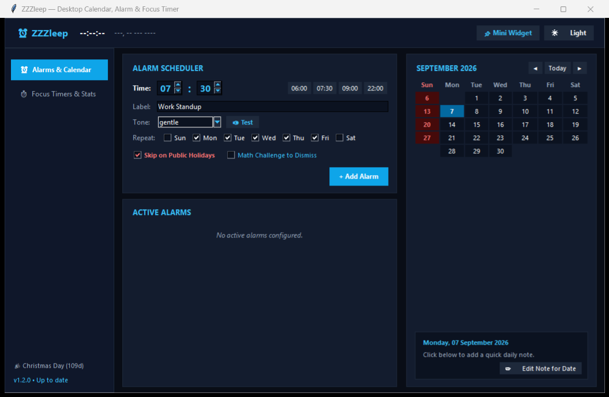
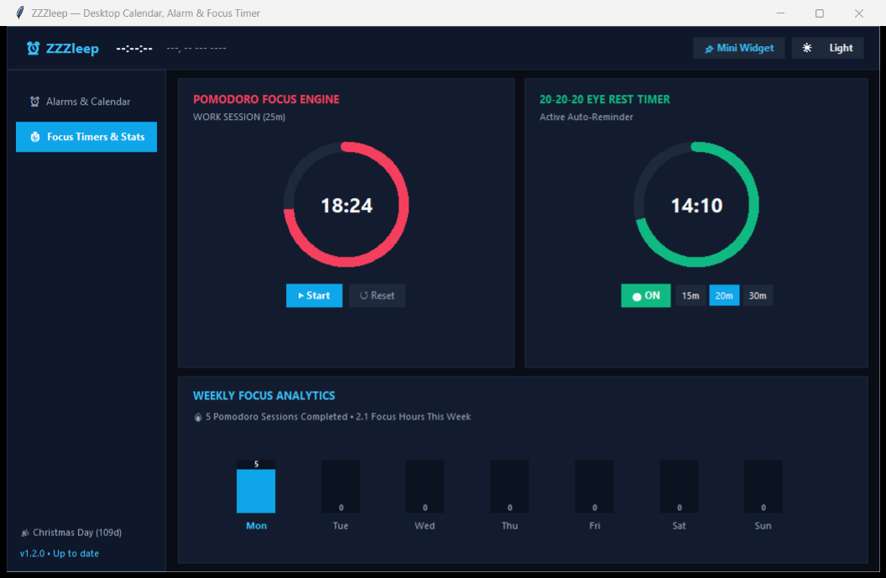
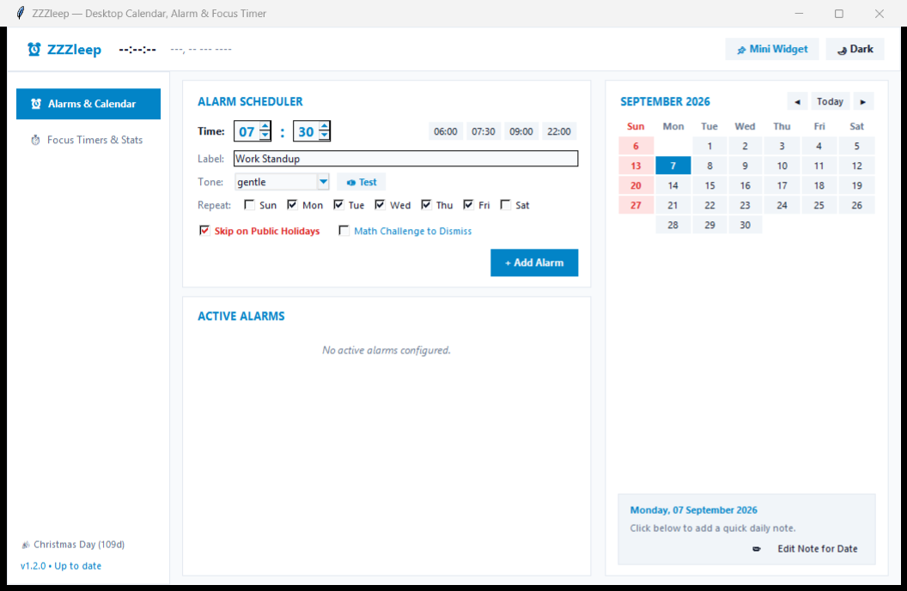

# ZZZleep — Desktop Calendar, Smart Alarms & Focus Timers

<div align="center">

[](https://github.com/InfiniteNull/ZZZleep)
[](LICENSE)
[](version.json)

<br />



</div>

> **ZZZleep** is a native desktop time-management tool featuring Indonesian public holiday intelligence, smart alarms (with optional math challenge & holiday skipping), circular Pomodoro & 20-20-20 eye rest progress rings, 7-day focus session analytics, mini floating widget overlay, and GitHub auto-update synchronization.

---

## User Interface Gallery

<div align="center">

### 1. Smart Alarm Scheduler & Indonesian Public Holidays Calendar (v1.2.0)


<br />

### 2. Dual Circular Focus Timers & 7-Day Session Analytics


<br />

### 3. Light Mode Theme View


</div>

---

## Key Capabilities (v1.2.0)

1. **Indonesian National Public Holidays & Long Weekend Detection**
   - Built-in SKB 3 Menteri holiday database for 2025–2027 with red highlight indicators on the calendar.
   - Automatic detection and banner display for 3+ consecutive days off (*Long Weekends*).
   - D-Day countdown banner for upcoming holidays (e.g., *🎉 Maulid Nabi in 9 days*).

2. **Smart Alarms (Holiday Skipping & Math Challenge)**
   - **Dual Spinbox Time Picker:** Separate hours and minutes spinboxes with permanent locked colon separator (` : `) and quick preset buttons.
   - **Skip on Holidays:** Automatically avoids ringing on public holidays.
   - **Math Challenge Alarm:** Requires solving an arithmetic problem (`num1 + num2 = ?`) before the alarm sound stops.

3. **Weekly Focus Analytics (7-Day Bar Chart)**
   - Canvas-rendered visual bar chart recording completed Pomodoro focus sessions each day (Mon–Sun).
   - Real-time productivity metrics: Total completed sessions, focus hours, and streak counter.

4. **Mini Floating Widget Mode (Always-on-Top)**
   - Instant compact desktop overlay (`300x100 px`) for monitoring active Pomodoro countdowns and upcoming alarms without taking screen space.

5. **5 Synthesized Harmonic Audio Tones (Zero External Dependencies)**
   - Live synthesis via Python `winsound.Beep` on background threads.
   - Tone options: *Gentle Arpeggio (C-Major)*, *Digital Pulse (880/1760Hz)*, *Harmonic Bell (440Hz)*, *Ascending Chime*, and *Zen Minimalist (520Hz)* with instant preview buttons.

6. **GitHub Auto-Update Synchronization**
   - Automatically checks `version.json` for new updates and prompts an interactive release modal with changelog details.

---

## Directory Structure

```text
ZZZleep/
├── assets/
│   ├── desktop_preview.png  # Alarms, Holidays Calendar & D-Day UI
│   ├── timers_preview.png   # Pomodoro, Eye Rest & Weekly Analytics Chart
│   └── vault_preview.png    # Light Mode Theme View
├── bin/
│   └── ZZZleep.exe          # Standalone v1.2.0 executable (12.2 MB)
├── desktop/
│   ├── app.py               # Main Tkinter desktop application
│   └── build_exe.py         # PyInstaller automated build script
├── version.json             # Version manifest & changelog for auto-update
├── requirements.txt         # Dependencies
├── index.html               # Web showcase landing page
└── README.md                # Documentation
```

---

## Download & Execution

### 1. Download Standalone Executable (.EXE)
Download the standalone binary directly: [**`bin/ZZZleep.exe`**](https://github.com/InfiniteNull/ZZZleep/raw/main/bin/ZZZleep.exe) and run it on Windows without installing Python.

### 2. Run Directly from Python
```bash
# Clone repository
git clone https://github.com/InfiniteNull/ZZZleep.git
cd ZZZleep

# Run application
python desktop/app.py
```

### 3. Build Standalone Executable with PyInstaller
```bash
pip install pyinstaller
python desktop/build_exe.py
```

---

## Author & License
Developed with clean code by **Rizki Ananda, S.Kom** ([@InfiniteNull](https://github.com/InfiniteNull)) • Distributed under the MIT License.
